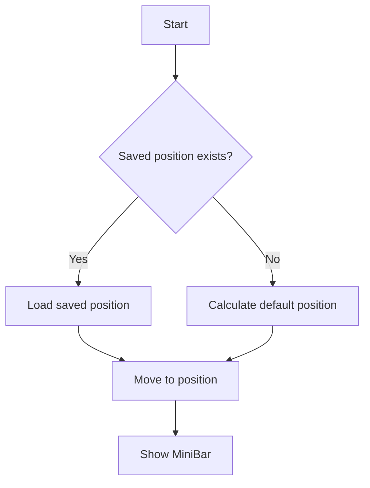

# MiniBar Position Guide

## 📍 Vị Trí Mặc Định

### Default Position
```python
# Top-right của màn hình chính
x = screen_width - minibar_width - 20  # 20px từ cạnh phải
y = 20                                  # 20px từ cạnh trên
```

**Ví dụ với màn hình 1920x1080:**
```
x = 1920 - 400 - 20 = 1500
y = 20
→ MiniBar ở góc phải trên: (1500, 20)
```

---

## 💾 Lưu Vị Trí

### QSettings Storage
MiniBar **TỰ ĐỘNG LÀU** vị trí mỗi khi bạn di chuyển nó.

**Storage location:**
```
Windows: HKEY_CURRENT_USER\Software\Mono\FileManager
File: %APPDATA%\Mono\FileManager.ini (hoặc Registry)
```

**Các giá trị được lưu:**

| Key | Mô tả | Ví dụ |
|-----|-------|-------|
| `minibar_x` | Absolute X position | 1500 |
| `minibar_y` | Absolute Y position | 20 |
| `minibar_offset_x` | Offset from Houdini right edge | -85 |
| `minibar_offset_y` | Offset from Houdini top edge | 0 |
| `minibar_rel_x` | Relative X (0.0-1.0) | 0.95 |
| `minibar_rel_y` | Relative Y (0.0-1.0) | 0.02 |

---

## 🔄 Restore Logic

### Khi MiniBar khởi động:



### Code Flow:
```python
# 1. Check saved position
saved_x = QSettings.value("minibar_x", -1)
saved_y = QSettings.value("minibar_y", -1)

# 2. Use saved or default
if saved_x != -1 and saved_y != -1:
    move(saved_x, saved_y)  # Saved position
else:
    move(*get_default_position())  # Default position
```

---

## 🖱️ Di Chuyển MiniBar

### 3 Cách Di Chuyển:

#### 1️⃣ Drag & Drop
- Kéo handle (⋮⋮) để di chuyển
- Auto-save khi thả chuột
- Lock/Unlock trong context menu

#### 2️⃣ Reset Position
**Right-click handle → "Reset Position"**
```python
# Xóa saved position
QSettings.remove("minibar_x")
QSettings.remove("minibar_y")

# Move to default
move(*get_default_position())
```

#### 3️⃣ Snap to Top-Right
**Right-click handle → "Snap to Top Right"**
```python
# Snap to Houdini window top-right
houdini_geo = hou.qt.mainWindow().geometry()
new_x = houdini_geo.right - minibar.width - 20
new_y = houdini_geo.top + 20
move(new_x, new_y)
```

---

## 🔒 Lock Position

**Right-click handle → "Lock Position"**

- ✅ Locked: Không thể drag
- ❌ Unlocked: Drag tự do

**Saved in:**
```python
QSettings.setValue("minibar_locked", True/False)
```

---

## 📐 Position Calculation

### Default Position Algorithm:

```python
def _get_default_position():
    # Get primary screen
    screen = QApplication.primaryScreen()
    screen_geo = screen.availableGeometry()
    
    # Calculate top-right position
    minibar_width = 400  # Approximate
    new_x = screen_geo.x() + screen_geo.width() - minibar_width - 20
    new_y = screen_geo.y() + 20
    
    # Ensure within bounds
    new_x = max(screen_geo.x() + 10, 
                min(new_x, screen_geo.x() + screen_geo.width() - minibar_width - 10))
    new_y = max(screen_geo.y() + 10,
                min(new_y, screen_geo.y() + screen_geo.height() - 40 - 10))
    
    return (new_x, new_y)
```

### Relative Position:

```python
# MiniBar position relative to Houdini main window
rel_x = (minibar.right - houdini.left) / houdini.width
rel_y = (minibar.top - houdini.top) / houdini.height

# Example: MiniBar at top-right corner of Houdini
rel_x = 0.95  # 95% from left edge
rel_y = 0.02  # 2% from top edge
```

---

## 🖥️ Multi-Monitor Support

### Primary Screen Detection
MiniBar sử dụng **primary screen** để tính vị trí mặc định:

```python
screen = QtWidgets.QApplication.primaryScreen()
screen_geo = screen.availableGeometry()
```

### Multi-Monitor Behavior:
- ✅ First launch: Appears on **primary monitor**
- ✅ After move: Saved position **works across monitors**
- ✅ Screen change: Position automatically adjusted

---

## 🛠️ Troubleshooting

### MiniBar xuất hiện ngoài màn hình
**Solution: Reset Position**
```python
# In Houdini Python Console:
from mono_tools import show_mono_minibar
minibar = show_mono_minibar()
minibar._reset_position()
```

### Vị trí không được lưu
**Check QSettings:**
```python
from mono_tools.qt import QtCore
s = QtCore.QSettings("Mono", "FileManager")
print(s.value("minibar_x"))  # Should print saved X
print(s.value("minibar_y"))  # Should print saved Y
```

### Clear saved position
```python
from mono_tools.qt import QtCore
s = QtCore.QSettings("Mono", "FileManager")
s.remove("minibar_x")
s.remove("minibar_y")
s.sync()
print("Position cleared!")
```

---

## 📊 Position Tracking

### Auto-Save Trigger:
```python
# Save after:
1. Mouse release (after drag)
2. Position stable for 3 frames
3. Significant movement (>5px)
```

### Smart Positioning:
```python
# MiniBar follows Houdini window when:
- Houdini window resized
- Houdini window moved
- Monitor configuration changed
```

---

## 💡 Best Practices

### Recommended Positions:

#### 1️⃣ Top-Right (Default)
```
✅ Best for: Quick access, doesn't block viewport
```

#### 2️⃣ Bottom-Right
```
✅ Best for: Above shelf, easy to access
```

#### 3️⃣ Floating Center
```
⚠️ OK but: May block viewport
```

---

## 🔧 Developer Notes

### Position Storage Strategy:

**Multiple formats stored:**
1. **Absolute** (`minibar_x`, `minibar_y`) - Exact screen coordinates
2. **Relative** (`minibar_rel_x`, `minibar_rel_y`) - Relative to Houdini window
3. **Offset** (`minibar_offset_x`, `minibar_offset_y`) - Offset from window edges

**Why 3 formats?**
- Absolute: Fast restore
- Relative: Handle window resize
- Offset: Handle multi-monitor

### Auto-Update Logic:
```python
# Monitor Houdini window changes
event_filter = MainWindowEventFilter(minibar)
hou.qt.mainWindow().installEventFilter(event_filter)

# Update position on:
- QEvent.Resize
- QEvent.Move
```

---

## 📚 Related Files

- **Code**: `python/mono_tools/file_manager/file_manager_minibar.py`
  - `_get_default_position()` - Calculate default
  - `_save_relative_position()` - Save position
  - `_restore_relative_position()` - Load position
  - `_reset_position()` - Reset to default

- **Settings**: QSettings("Mono", "FileManager")
  - Windows: Registry or .ini file
  - Location: %APPDATA%\Mono\

---

**Last Updated**: 2024-12-19
**Version**: 2.2.0

