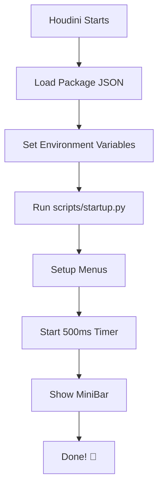

# Mono Studio Simplified Startup Guide

## 📋 Overview

Startup system đã được đơn giản hóa và sử dụng **Houdini's Standard Method**: `python3.11libs/uiready.py`

## 🎯 Cấu Trúc Mới (Standard & Reliable)

### 1. Package Configuration
**File**: `MonoStudio_package.json`
```json
{
  "env": [...],
  "path": ["$MONO_STUDIO/python"]
}
```
- **Không cần** "script" field!
- Chỉ cần set HOUDINI_PATH → Houdini tự động tìm python3.11libs/

### 2. UI Ready Startup
**File**: `python3.11libs/uiready.py` (45 dòng)

```python
# 1. Setup menus
setup_file_manager_tools()
setup_material_loader_tools()
setup_texture_tools()

# 2. Show MiniBar (NO DELAY NEEDED!)
minibar = show_mono_minibar()  # UI already ready!
```

**Chỉ làm 2 việc:**
1. ✅ Setup menu integrations
2. ✅ Show MiniBar ngay lập tức (UI đã ready!)

### 🎯 Key Difference: UI Ready = No Delay!
- File tên `uiready.py` chạy SAU KHI Houdini UI đã load xong
- Không cần `QTimer.singleShot(500, ...)` delay
- Reliable và standard Houdini convention

## 🔧 So Sánh Trước/Sau

### ❌ TRƯỚC (Phức tạp - 200+ dòng)

```
MonoStudio_package.json
  ↓
scripts/startup.py (100 dòng)
  • package_startup() function
  • Nhiều debug prints
  • Manual path management
  • Complex error handling
  • Version checking logic
  • Multiple setup functions
  ↓
python/startup/auto_load.py (70 dòng)
  • auto_load_mono_studio() function
  • Duplicate logic
  • Settings check
  • Delayed show with timer
  ↓
python/mono_tools/__init__.py
  • initialize() function (30 dòng)
  • Fallback logic
  • Wrapper creation
```

### ✅ SAU (Đơn giản - 45 dòng)

```
MonoStudio_package.json
  ↓
scripts/startup.py (45 dòng)
  • Import và setup menus
  • Delayed minibar show (500ms)
  • Error handling with traceback
  ↓
DONE! ✨
```

## 📝 File Changes

### ✅ Simplified
- `scripts/startup.py`: 100 dòng → **45 dòng**
- `python/mono_tools/__init__.py`: Xóa initialize() function

### 🗑️ Deleted
- `python/startup/auto_load.py`: Không dùng đến, bị duplicate logic

## 🧪 Testing

### Test Script
**File**: `python/mono_tools/test_demo/test_simplified_startup.py`

```python
# Run in Houdini Python Console
from mono_tools.test_demo.test_simplified_startup import test_startup
test_startup()

# Test visual MiniBar
from mono_tools.test_demo.test_simplified_startup import test_manual_minibar
test_manual_minibar()
```

### Test Checklist
- [x] Package imports correctly
- [x] All functions exported
- [x] Menu setup works
- [x] MiniBar creation works
- [x] Startup script is clean

## 💡 Nguyên Tắc Thiết Kế

### 1. Keep It Simple
- Không cần path management phức tạp (package.json đã handle)
- Không cần version checking (có trong version.py)
- Không cần settings check (minibar tự check)

### 2. Package JSON Handles Paths
```json
{
  "PYTHONPATH": "$MONO_STUDIO/python;&",
  "HOUDINI_PATH": "$MONO_STUDIO;&"
}
```
→ Không cần thêm sys.path trong code!

### 3. One Entry Point
- Chỉ 1 file startup: `scripts/startup.py`
- Không có duplicate logic
- Dễ maintain, dễ debug

### 4. Minimal Error Handling
```python
try:
    setup_menus()
except Exception as e:
    print(f"❌ Failed: {e}")
    traceback.print_exc()
```
→ Đủ để debug, không quá phức tạp

## 🚀 Startup Flow



**Total time**: ~500-600ms từ khi Houdini load xong UI

## 📊 Benefits

### Performance
- ⚡ **Faster**: Ít code hơn = load nhanh hơn
- 🎯 **Focused**: Chỉ làm đúng những gì cần thiết
- 🔧 **No overhead**: Không có logic thừa

### Maintainability
- 📖 **Easy to read**: 45 dòng ai cũng hiểu
- 🐛 **Easy to debug**: Ít code = ít bug
- ✏️ **Easy to modify**: Thay đổi 1 chỗ duy nhất

### Reliability
- ✅ **No duplicate logic**: Không bị conflicts
- ✅ **Clear flow**: Biết rõ code chạy như thế nào
- ✅ **Better error messages**: traceback rõ ràng

## 🔍 Troubleshooting

### MiniBar không show
```python
# Check trong Houdini Python Console
from mono_tools import show_mono_minibar
minibar = show_mono_minibar()
print(minibar)  # Should not be None
```

### Menu không show
```python
# Check setup functions
from mono_tools import setup_file_manager_tools
setup_file_manager_tools()
# Should print success message
```

### Import errors
```python
# Check PYTHONPATH
import sys
print([p for p in sys.path if 'MonoStudio' in p])
# Should show MonoStudio25/python
```

## 📚 Related Files

- `MonoStudio_package.json`: Package configuration
- `scripts/startup.py`: Main startup script (45 dòng)
- `python/mono_tools/__init__.py`: Package exports
- `python/mono_tools/test_demo/test_simplified_startup.py`: Test script

## ✨ Summary

**Before**: 200+ lines, 3 files, duplicate logic, complex flow
**After**: 45 lines, 1 file, clean logic, simple flow

→ **Đơn giản là tốt nhất!** 🎉

---

**Last Updated**: 2024-12-19
**Version**: 2.2.0
**Status**: Production Ready

